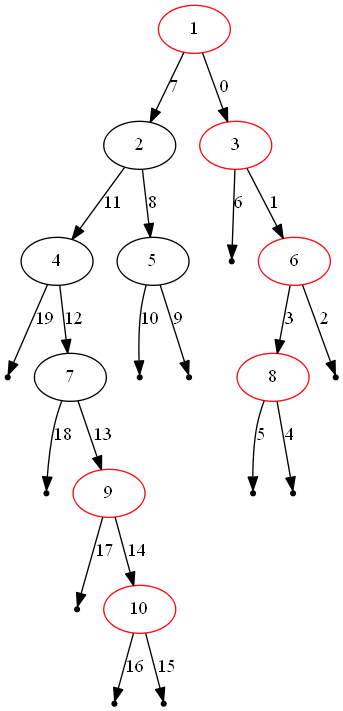
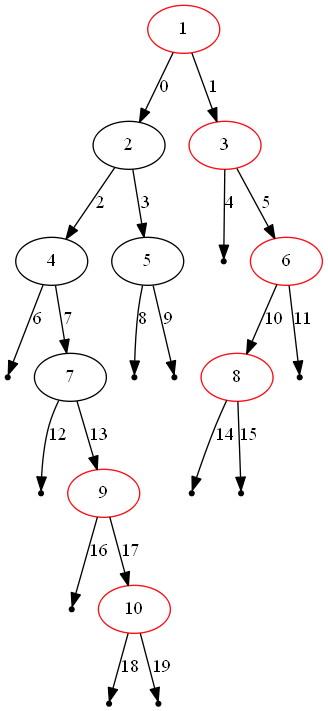

# 199. Binary Tree Right Side View
Medium

Given a binary tree, imagine yourself standing on the right side of it, return the values of the nodes you can see ordered from top to bottom.

Example:

Input: [1,2,3,null,5,null,4]
Output: [1, 3, 4]
Explanation:
```
   1            <---
 /   \
2     3         <---
 \     \
  5     4       <---
```
---

## 199. 二叉树的右视图

给定一棵二叉树，想象自己站在它的右侧，按照从顶部到底部的顺序，返回从右侧所能看到的节点值。

示例:

输入: [1,2,3,null,5,null,4]
输出: [1, 3, 4]
解释:
```!
   1            <---
 /   \
2     3         <---
 \     \
  5     4       <---
```
---

## 解题思路： 
如果按正确的顺序访问每个节点，就可以有效地获得二叉树的右视图。可以使用深度优先遍历和广度优先遍历。再配合使用map来获取到层级的节点。
- dfs + recursion + map
- dfs + stack + map
- bfs + queue + map


### dfs + recursion + map
深度优先遍历（先序），配合使用递归。我们总是先访问右子树。这样就保证了当我们访问树的某个特定深度时，我们正在访问的节点总是该深度的最右侧节点。并使用map，存储在每个深度访问的第一个结点。

```javascript
/**
 * Definition for a binary tree node.
 * function TreeNode(val) {
 *     this.val = val;
 *     this.left = this.right = null;
 * }
 */
/**
 * @param {TreeNode} root
 * @return {number[]}
 */
var rightSideView = function(root) {
    if (!root) return []
    let map = new Map()
    function dfs (node, depth) {
        if (!node) return
        if (!map.has(depth)) map.set(depth, node.val)
        dfs(node.right, depth + 1)
        dfs(node.left, depth + 1)
    }
    dfs(root, 0)
    return [...map.values()]
};
```

### dfs + stack + map
深度优先遍历，配合使用栈。跟上述递归的思路相同，只是使用了栈先进后出的特性，将每一次访问过的节点左侧先推入栈，再将右侧推入栈。这样就保证了，我们每次推出栈的都是优先推出最右侧节点。并使用map，存储在每个深度访问的第一个结点。
```javascript
/**
 * Definition for a binary tree node.
 * function TreeNode(val) {
 *     this.val = val;
 *     this.left = this.right = null;
 * }
 */
/**
 * @param {TreeNode} root
 * @return {number[]}
 */
var rightSideView = function(root) {
  if (!root) return []
  let map = new Map()
  let stack = [{node: root, depth: 0}]
  while(stack.length) {
      let {node, depth} = stack.pop()
      if (!map.has(depth) && node) map.set(depth, node.val)
      if (node.left) stack.push({node: node.left, depth: depth + 1})
      if (node.right) stack.push({node: node.right, depth: depth + 1})
  }
  return [...map.values()]
};
```


### bfs + queue + map
广度优先遍历，配置使用queue，记录每次遍历的节点和次节点的层级，保证了当我们访问树的某个特定深度时，我们最后访问的节点总是该深度最右侧的节点。此外，在每次遍历的时候，都使用map来根据每次层级，重新设置node的值，这样，每层级的node值都是最新的，也就是右视图所需要的。

```javascript
/**
 * Definition for a binary tree node.
 * function TreeNode(val) {
 *     this.val = val;
 *     this.left = this.right = null;
 * }
 */
/**
 * @param {TreeNode} root
 * @return {number[]}
 */
var rightSideView = function(root) {
    if (!root) return []
    let queue = [{node: root, depth: 0}]
    let map = new Map()
    while(queue.length) {
        let {node, depth} = queue.shift()
        if (node) map.set(depth, node.val)
        if (node.left) queue.push({node: node.left, depth: depth + 1})
        if (node.right) queue.push({node: node.right, depth: depth + 1})  
    }
    return [...map.values()]
};
```
- 时间复杂度 : O(n)
- 空间复杂度 : O(n)。由于广度优先搜索逐层访问整棵树，在访问最大的层之前，队列将最大。该层最坏的情况下可能有 0.5n=O(n) 大小（一棵完整的二叉树）。

## 来源：
- (LeetCode)[https://leetcode.com/problems/binary-tree-right-side-view/]
- (力扣（LeetCode）)[https://leetcode-cn.com/problems/binary-tree-right-side-view]